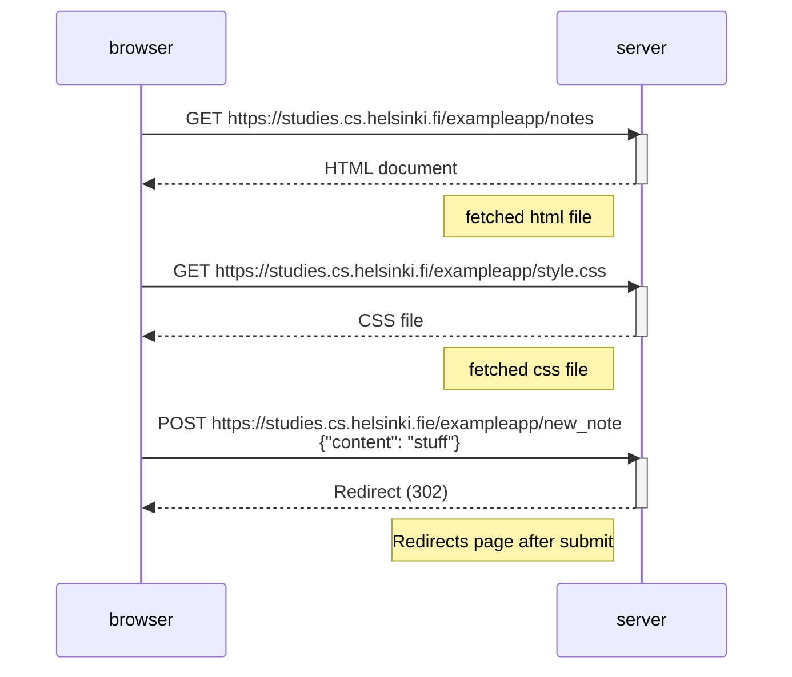

```mermaid
sequenceDiagram
  participant browser
  participant server

  browser->>server: GET https://studies.cs.helsinki.fi/exampleapp/notes
  activate server

  server-->>browser: HTML document
  deactivate server
  Note left of server: fetched html file

  browser->>server: GET https://studies.cs.helsinki.fi/exampleapp/style.css
  activate server

  server-->>browser: CSS file
  deactivate server
  Note left of server: fetched css file

  browser->>server: POST https://studies.cs.helsinki.fie/exampleapp/new_note<br/>{"content": "stuff"}
  activate server
  server-->>browser: Redirect (302)
  deactivate server
  Note left of server: Redirects page after submit
```
