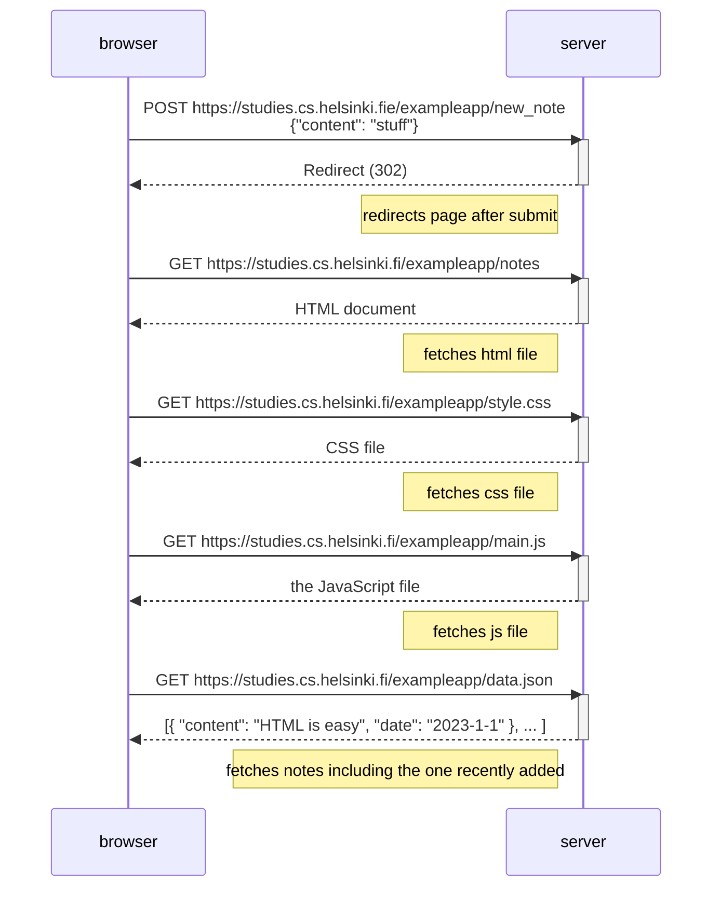

```mermaid
sequenceDiagram
  participant browser
  participant server

  browser->>server: POST https://studies.cs.helsinki.fie/exampleapp/new_note<br/>{"content": "stuff"}
  activate server
  server-->>browser: Redirect (302)
  deactivate server
  Note left of server: redirects page after submit

  browser->>server: GET https://studies.cs.helsinki.fi/exampleapp/notes
  activate server

  server-->>browser: HTML document
  deactivate server
  Note left of server: fetches html file

  browser->>server: GET https://studies.cs.helsinki.fi/exampleapp/style.css
  activate server

  server-->>browser: CSS file
  deactivate server
  Note left of server: fetches css file

  browser->>server: GET https://studies.cs.helsinki.fi/exampleapp/main.js
  activate server
  server-->>browser: the JavaScript file
  deactivate server
  Note left of server: fetches js file

  browser->>server: GET https://studies.cs.helsinki.fi/exampleapp/data.json
  activate server
  server-->>browser: [{ "content": "HTML is easy", "date": "2023-1-1" }, ... ]
  deactivate server
  Note left of server: fetches notes including the one recently added

```
