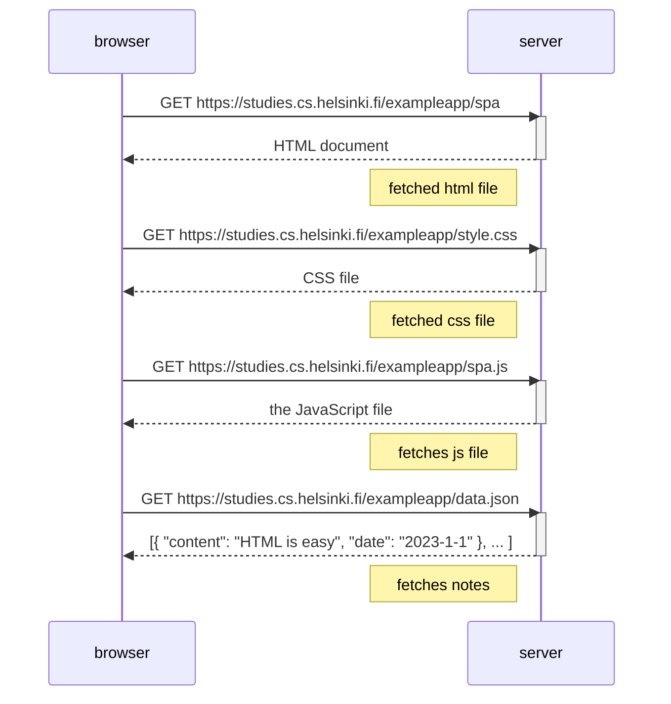

```mermaid
sequenceDiagram
  participant browser
  participant server

  browser->>server: GET https://studies.cs.helsinki.fi/exampleapp/spa
  activate server

  server-->>browser: HTML document
  deactivate server
  Note left of server: fetched html file

  browser->>server: GET https://studies.cs.helsinki.fi/exampleapp/style.css
  activate server

  server-->>browser: CSS file
  deactivate server
  Note left of server: fetched css file

  browser->>server: GET https://studies.cs.helsinki.fi/exampleapp/spa.js
  activate server
  server-->>browser: the JavaScript file
  deactivate server
  Note left of server: fetches js file

  browser->>server: GET https://studies.cs.helsinki.fi/exampleapp/data.json
  activate server
  server-->>browser: [{ "content": "HTML is easy", "date": "2023-1-1" }, ... ]
  deactivate server
  Note left of server: fetches notes
```
