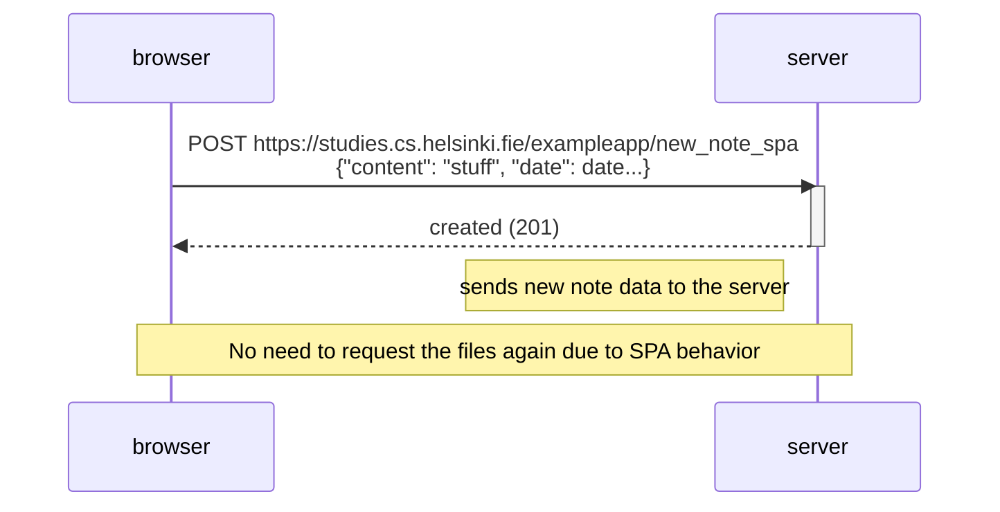

```mermaid
sequenceDiagram
  participant browser
  participant server

  browser->>server: POST https://studies.cs.helsinki.fie/exampleapp/new_note_spa<br/>{"content": "stuff", "date": date...}
  activate server
  server-->>browser: created (201)
  deactivate server
  Note left of server: sends new note data to the server

  Note over browser, server: No need to request the files again due to SPA behavior
```
